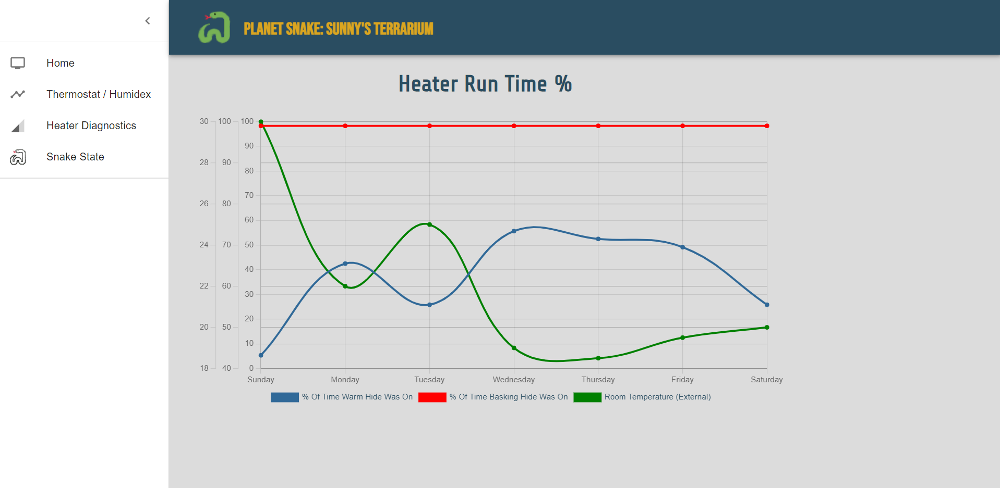
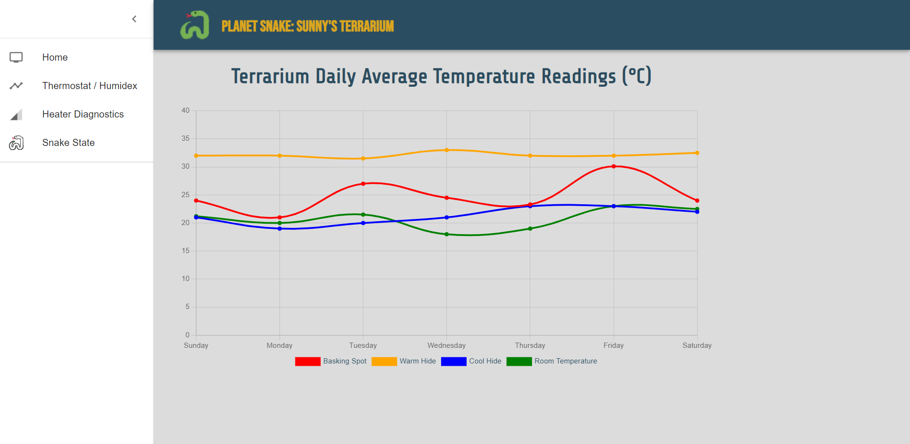

<h1>Planet Snake Web Interface</h1>

This is a React.JS front end to connect to Planet Snake Hardware API.

This is the main landing page. The lights in the terrarium can be switched between Day and Night mode by hitting the sun and moon ying yang. It will rotate to show the current state of the terrarium when clicked. The right hand side has the current temperatures in the controlled areas as well as the ability to set the target temperature for those zones.

This was an example graph to show data from the database. The data is currently hardcoded while I build the database

This was an another example graph to show data from the database. The data is currently hardcoded while I build the database
